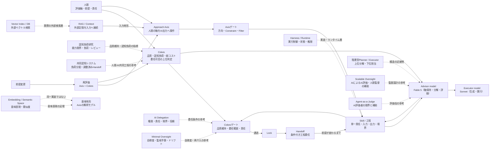

# Cokes / Approach Axis — Research Connection Map（粗案）

> ステータス: 概略・投稿前精査待ち
> 目的: Cokes／Approach Axisと、周辺研究・公開資料の接続を可視化する。
> 注意: 確定版の理論図ではない。各接続は「参考」「近い問題設定」「解釈の足場」「実装層との対応」を区別して再確認する。

## 1. 全体図

## 2. この図で言いたいこと

### Cokes

Cokesは、AIに何をさせるかだけでなく、**人間が担っていた工程をどこまで任せられるか**を判断する上位層として置く。

- 品質維持が確認されているか
- 人間の評価軸から逸脱していないか
- 人間のレビュー・修正・再判断コストが許容できるか
- 委任する工程と範囲が明示されているか
- 前提変更時に再評価できるか

「任せられるか」の評価と、「任せる」という決定は分ける。委任の決定と最終責任は人間に残る。

### Approach Axis

Axisは、人間が定義した評価軸を、自然言語の操作としてAI出力へ適用する層である。

- Position / Magnitudeで寄せ先と寄せ方を指定する
- Constraint / Filterで逸脱を抑える
- Blend / Retryで候補と再接近を扱う
- 出力が人間の評価軸に沿ったかを観測する

AxisはAI内部のベクトルを直接操作する理論ではない。プロンプト操作と内部アクティベーション操作が同じ表現変化を生むとも仮定しない。

### Handoff

Handoffは成果物の単純な受け渡しではなく、**品質維持が確認された工程を、明示した前提が変わるまでは任せられる条件付き出口**である。

必要な記録:

- 委任する工程
- 任せられる範囲
- 成立前提と参照資料
- 未確定事項
- 再評価条件
- 次の責任者

## 3. 外部研究との対応メモ

| 研究・資料 | 主な論点 | Cokes / Axisとの接続 | 接続の種類 |
|---|---|---|---|
| [Intelligent AI Delegation](https://arxiv.org/abs/2602.11865) | 権限、責任、説明責任、役割境界、意図、信頼、継続監視 | Cokesの委任判定、Handoff条件と近い | 近い問題設定。統合実務層は別 |
| [Minimal Oversight](https://arxiv.org/abs/2606.15563) | 自律度、監視予算、品質上限、ドリフト、介入時期 | 前提が変わるまでの委任、再評価条件と接続 | 近い問題設定。数理モデルは別 |
| [Beyond Accuracy](https://ojs.aaai.org/index.php/AAAI/article/view/40650) | ツール操作の認知負荷と能力限界 | Cokesの認知負荷・レビュー圧縮の観測指標 | 補強。対象はツール利用エージェント |
| [Overloaded minds and machines](https://link.springer.com/article/10.1007/s10462-026-11510-z) | 共同認知システム、負荷分配、調整済みHandoff | Cokesの人間-AI工程設計と近い | 補強。Axisの自然言語操作は別 |
| [A Cognitive Framework for Delegation Between Error-Prone AI and Human Agents](https://arxiv.org/abs/2204.02889) | 人間とAIのどちらへ制御を委譲するか | 委任可能性・人間／AIの役割分担 | 先行する近接概念 |
| [Sentence-BERT](https://arxiv.org/abs/1908.10084) | 文埋め込み、意味的類似度、コサイン類似度 | 意味空間・意味地形を理解する足場 | 類似概念。Axisの実装証明ではない |
| [Retrieval-Augmented Generation](https://arxiv.org/abs/2005.11401) | パラメトリック記憶と外部dense vector indexの接続 | 入力地形、外部記憶、Context Engineeringとの接続 | 実装層の参考。LLM内部空間とは別 |
| Harness engineering / agent runtime | 制御、権限、状態、ツール、エージェント間Handoff | Skill・Templates・実行雛形層との接続 | 実装層。Cokesの上位判定とは別 |
| [Hierarchical LLM-Based Multi-Agent Framework](https://arxiv.org/abs/2602.21670) | 上位層のタスク分解・下位エージェント割当 | Advisor→Executorの役割分担と近い | 構造の近接例。人間に近い軸の保持は未検証 |
| [On scalable oversight with weak LLMs judging strong LLMs](https://arxiv.org/abs/2407.04622) | AIがAIを評価し、人間の監督を拡張する | Advisorの評価役・人間確認圧縮の問いと接続 | 近い問題設定。実験ではjudgeが弱い場合も含む |
| [When AIs Judge AIs](https://arxiv.org/abs/2508.02994) | Agent-as-a-Judgeの有効性・バイアス・頑健性 | Advisorを自動評価役として扱う際の限界 | 補強。人間監督を置換しない |
| [Multi-Agent-as-Judge](https://arxiv.org/abs/2507.21028) | 複数観点の評価と人間評価との一致 | 人間の評価軸をAdvisorが保持する設計の参考 | 近い評価例。Fable 5／Sonnetの有効性は未検証 |

## 4. 矢印の読み方

- **実線:** Cokes／Axis内部の運用関係
- **破線:** 外部研究との参考・類似・補強関係
- **「近い問題設定」:** 同じ理論ではなく、問いの一部が重なる
- **「補強」:** Axis／Cokesの観測項目や解釈を考える足場
- **「実装層」:** Harness、Vector DB、RAGなど、運用を実装する技術層

外部研究がCokes／Axisの正しさを証明するとは書かない。逆に、接続しない部分が見つかった場合も、Axisへ無理に合わせず「対象・粒度・目的が異なる」として残す。

## 5. 投稿時に再確認する項目

- 論文の最終版、著者、発表年、査読状態を確認する
- プレプリントと査読済み論文を図上で区別する
- 「証明」「理論的一致」ではなく、「参考」「接続」「近い問題設定」と表現する
- Axisの意味地形と、実際のEmbedding／Vector DB／RAGを同一視しない
- Cokes／Axisの説明が、既存研究の要約を超えていないか確認する
- 投稿先の文脈に合わせ、全体図・研究別図・論点別スレッドに分割する
- 反応を理論の正しさと解釈せず、外部フィードバックとして記録する
